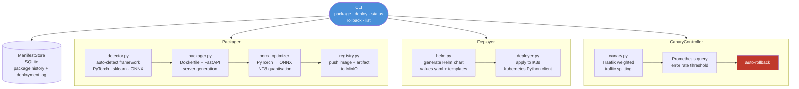
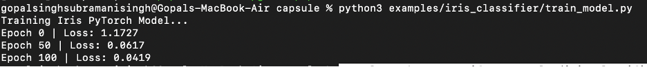
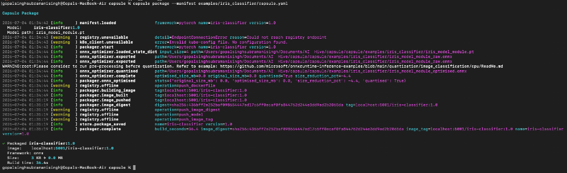
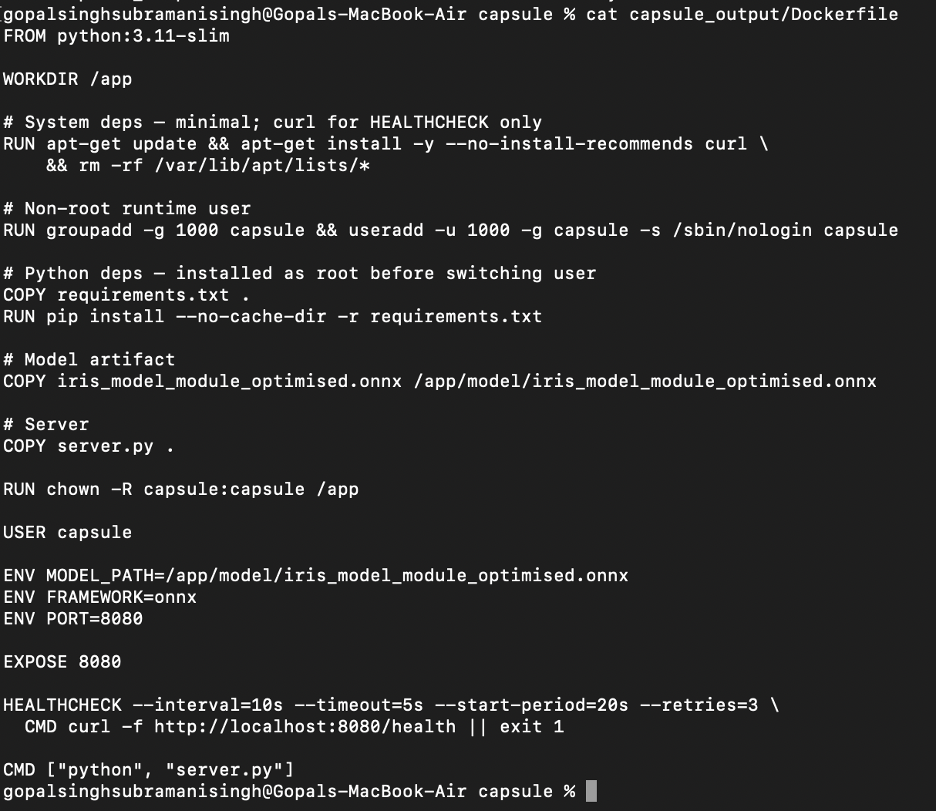

# Capsule — Container-Native Model Deployment Platform

Package, deploy, and manage ML models on Kubernetes with one CLI. Built for Apple Silicon. $0 budget. K3s + Docker + MinIO.

---

## What it does

Capsule automates the full model deployment lifecycle: it detects your ML framework, generates a Dockerfile and model-serving FastAPI server, optimises the model to ONNX, builds a Docker image, pushes to a local MinIO model registry, generates a Helm chart, and deploys to K3s with canary traffic splitting and automatic rollback.

---

## Why it matters

Deploying an ML model to production requires solving half a dozen infrastructure problems that have nothing to do with the model itself: containerization, image registry, Kubernetes manifests, traffic routing, version management, and rollback. Capsule demonstrates these patterns as a cohesive CLI tool — the same workflow that MLOps platforms like BentoML or Seldon solve at scale.

---

## Architecture



---

## Features

- **Framework auto-detection**: detects PyTorch, scikit-learn, ONNX from model artifact
- **Dockerfile generation**: generates appropriate Dockerfile per framework
- **FastAPI server generation**: produces a ready-to-run model serving endpoint
- **ONNX optimisation**: converts PyTorch → ONNX with optional INT8 quantisation for model size reduction
- **MinIO model registry**: versioned model artifact storage in local S3-compatible object store
- **Helm chart generation**: generates Kubernetes deployment manifests via Helm templating
- **K3s deployment**: deploys to local Kubernetes via Python kubernetes client
- **Canary deployment**: traffic split via Traefik weighted routing (e.g., 90% v1 / 10% v2)
- **Automatic rollback**: monitors Prometheus error rate and rolls back if threshold exceeded
- **`capsule status`**: Rich table showing pod health, canary %, version, recent events
- **Deployment history**: SQLite-backed log of all packages and deployments
- **Two example models**: fraud detector and sentiment classifier with training scripts

> ⚠️ **K3s deployment note**: K3s deployment support is fully implemented. End-to-end local K3s demo verification is pending — requires K3s installation (`curl -sfL https://get.k3s.io | sh -`). All CLI commands work without K3s for packaging and registry operations.

---

## Tech Stack

Python · Typer · Docker · Helm · Kubernetes (K3s) · MinIO · ONNX Runtime · FastAPI · Prometheus · SQLite · Rich

---

## Quickstart

### Prerequisites

```bash
cd capsule
brew install helm
pip install -r requirements.txt
pip install -e .
```

### Start infrastructure

```bash
cd capsule
docker compose up minio registry -d
```

### K3s setup (one-time — optional for packaging, required for deploy)

```bash
curl -sfL https://get.k3s.io | sh -
export KUBECONFIG=/etc/rancher/k3s/k3s.yaml
```

### Train a demo model

```bash
cd capsule
python examples/fraud_detector/train_model.py
```

### Package

```bash
capsule package --manifest examples/fraud_detector/capsule.yaml
```

### Deploy (full traffic)

```bash
capsule deploy fraud-detector:1.0
```

### Deploy with canary (10% to new version)

```bash
capsule deploy fraud-detector:2.0 --canary 10
```

### Monitor

```bash
capsule status fraud-detector
```

### Rollback

```bash
capsule rollback fraud-detector --yes
```

### List all packages

```bash
capsule list
```

---

## API / CLI Usage

### Model manifest (`capsule.yaml`)

```yaml
name: fraud-detector
version: "1.0"
framework: pytorch
model_path: ./model.pt
input_schema:
  - name: amount
    type: float
  - name: merchant_type
    type: int
output_schema:
  - name: fraud_probability
    type: float
resources:
  cpu: "0.5"
  memory: "512Mi"
replicas: 1
```

### CLI commands

```bash
capsule package --manifest capsule.yaml   # package model
capsule deploy <name>:<version>           # deploy to K3s
capsule deploy <name>:<version> --canary 10  # canary at 10%
capsule status <name>                     # show deployment status
capsule rollback <name> --yes             # roll back to previous
capsule list                              # list all packages
```

---

## Tests

```bash
# Run all tests (no K3s or Docker needed)
pytest tests/ -v

# With coverage
pytest tests/ -v --cov=capsule
```

40+ tests covering: framework detector, packager, ONNX optimizer, MinIO registry, deployer, canary controller, manifest store, integration tests.

---

## Observability

- **MinIO console**: http://localhost:9001 (minioadmin / minioadmin) — model artifact browser
- **Prometheus**: http://localhost:9090 — deployment metrics
- **Grafana**: http://localhost:3000 (admin / capsule) — deployment dashboard

Capsule exposes deployment metrics to Prometheus and queries them for automatic canary rollback decisions.

---

## Demo

```bash
# Navigate to capsule directory
cd capsule

# 1. Train a demo fraud detection model
python examples/fraud_detector/train_model.py

# 2. Package it
capsule package --manifest examples/fraud_detector/capsule.yaml
# Generates Dockerfile, builds image, ONNX-optimises, pushes to MinIO registry

# 3. List packages
capsule list

# 4. Deploy (requires K3s)
capsule deploy fraud-detector:1.0

# 5. Check status
capsule status fraud-detector

# 6. Deploy v2 with canary
capsule deploy fraud-detector:2.0 --canary 10
# 90% traffic → v1, 10% traffic → v2

# 7. Promote or rollback
capsule rollback fraud-detector --yes   # rollback to v1
```

---

## Known Limitations

- **K3s required for deploy**: `capsule package` and `capsule list` work without K3s. `capsule deploy`, `capsule status`, and `capsule rollback` require K3s running locally.
- **K3s demo unverified**: End-to-end K3s deployment has been implemented but not verified in a clean local environment. Mark as: *K3s deployment support implemented; local demo verification pending.*
- **ONNX optimisation is approximate**: The size reduction from ONNX conversion varies by model architecture. INT8 quantisation may reduce accuracy. Results depend on the specific model.
- **Canary requires Traefik**: Canary traffic splitting depends on K3s's built-in Traefik ingress. Other ingress controllers are not currently supported.
- **No multi-cluster support**: Capsule targets a single local K3s instance. It is not a multi-cluster deployment platform.
- **Docker required for packaging**: Building images requires Docker running locally. Buildah or Podman are not currently supported.

---

## Future Work

- End-to-end K3s demo verification with reproducible setup script
- Support ONNX Runtime as a serving backend (not just optimisation)
- Add model A/B testing with Prometheus-based automatic traffic promotion
- Multi-cluster deploy support
- Model performance regression gate during packaging

---


## Screenshots



