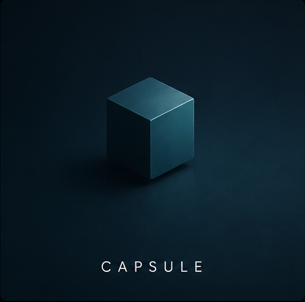

<p align="center">
  
</p>

<h1 align="center">Capsule</h1>

<p align="center">
  <strong>Container-Native Model Deployment Platform</strong>
</p>

<p align="center">
  Package, deploy, monitor, and roll back ML models on local Kubernetes with one CLI.
  Built with Docker, K3s, MinIO, Helm, FastAPI, ONNX, Prometheus, and SQLite.
</p>

<p align="center">
  
  
  
  
  
</p>

---

## Overview

**Capsule** is a local-first model deployment platform for packaging and managing ML models on Kubernetes.

It automates the deployment lifecycle by detecting the model framework, generating a serving layer, creating Docker packaging assets, optimizing models to ONNX, storing artifacts in a local MinIO registry, generating Helm charts, and deploying versions to K3s with canary traffic splitting and rollback support.

The goal is to demonstrate the infrastructure layer behind production MLOps platforms such as BentoML, Seldon, KServe, and internal model deployment systems.

---

## Why It Matters

Deploying an ML model is not just about training accuracy. A production deployment workflow needs to solve:

* framework-aware model packaging
* serving API generation
* Docker image creation
* model artifact versioning
* Kubernetes deployment manifests
* canary releases
* rollout monitoring
* rollback after failed deployments

Capsule connects these pieces into a cohesive CLI-driven workflow that runs locally on Apple Silicon.

---

## Architecture


---

## Features

* **Framework auto-detection** for PyTorch, scikit-learn, and ONNX artifacts
* **Dockerfile generation** tailored to the detected model framework
* **FastAPI model server generation** for ready-to-run inference endpoints
* **ONNX optimization path** for PyTorch to ONNX conversion with optional INT8 quantization
* **Local MinIO model registry** for versioned artifact storage
* **Helm chart generation** for Kubernetes deployment manifests
* **K3s deployment support** through the Kubernetes Python client
* **Canary deployment workflow** using Traefik-style weighted routing
* **Automatic rollback logic** driven by Prometheus error-rate checks
* **Deployment history** stored in SQLite
* **Rich CLI status output** for pod health, version, canary percentage, and recent events
* **Example models** for fraud detection and sentiment classification

> **K3s deployment note:** K3s deployment support is implemented, but end-to-end local K3s demo verification is pending. Packaging and registry operations can be used without K3s; deployment commands require a running local K3s cluster.

---

## Tech Stack

| Area               | Tools                               |
| ------------------ | ----------------------------------- |
| CLI                | Typer, Rich                         |
| Packaging          | Docker, generated Dockerfiles       |
| Serving            | FastAPI                             |
| Model Optimization | ONNX Runtime                        |
| Registry           | MinIO                               |
| Deployment         | Kubernetes Python client, K3s, Helm |
| Traffic Control    | Traefik-style canary routing        |
| Monitoring         | Prometheus                          |
| State              | SQLite                              |
| Examples           | PyTorch, scikit-learn               |

---

## Quickstart

### 1. Install prerequisites

```bash
cd capsule
brew install helm
pip install -r requirements.txt
pip install -e .
```

### 2. Start local infrastructure

```bash
docker compose up minio registry -d
```

### 3. Optional: install K3s for deployment

Packaging works without K3s. Deployment commands require K3s.

```bash
curl -sfL https://get.k3s.io | sh -
export KUBECONFIG=/etc/rancher/k3s/k3s.yaml
```

### 4. Train a demo model

```bash
python examples/fraud_detector/train_model.py
```

### 5. Package the model

```bash
capsule package --manifest examples/fraud_detector/capsule.yaml
```

### 6. Deploy to K3s

```bash
capsule deploy fraud-detector:1.0
```

### 7. Deploy with canary traffic

```bash
capsule deploy fraud-detector:2.0 --canary 10
```

### 8. Monitor and rollback

```bash
capsule status fraud-detector
capsule rollback fraud-detector --yes
capsule list
```

---

## Model Manifest

Example `capsule.yaml`:

```yaml
name: fraud-detector
version: "1.0"
framework: pytorch
model_path: ./model.pt
input_schema:
  - name: amount
    type: float
  - name: merchant_type
    type: int
output_schema:
  - name: fraud_probability
    type: float
resources:
  cpu: "0.5"
  memory: "512Mi"
replicas: 1
```

---

## CLI Usage

| Command                                       | Description                       |
| --------------------------------------------- | --------------------------------- |
| `capsule package --manifest capsule.yaml`     | Package a model                   |
| `capsule deploy <name>:<version>`             | Deploy a model version to K3s     |
| `capsule deploy <name>:<version> --canary 10` | Deploy with 10% canary traffic    |
| `capsule status <name>`                       | Show deployment status            |
| `capsule rollback <name> --yes`               | Roll back to the previous version |
| `capsule list`                                | List all packaged models          |

---

## Observability

Capsule integrates with local observability tools for deployment visibility and canary rollback decisions.

| Tool          | URL                     | Purpose                           |
| ------------- | ----------------------- | --------------------------------- |
| MinIO Console | `http://localhost:9001` | Browse model artifacts            |
| Prometheus    | `http://localhost:9090` | Deployment and error-rate metrics |
| Grafana       | `http://localhost:3000` | Deployment dashboard              |

Default MinIO login:

```text
minioadmin / minioadmin
```

Default Grafana login:

```text
admin / capsule
```

---

## Tests

```bash
pytest tests/ -v
```

With coverage:

```bash
pytest tests/ -v --cov=capsule
```

The test suite covers framework detection, packaging, ONNX optimization, MinIO registry behavior, Helm generation, deployment logic, canary control, manifest storage, and integration paths.

---

## Demo Flow

```bash
# 1. Train a demo fraud detection model
python examples/fraud_detector/train_model.py

# 2. Package it
capsule package --manifest examples/fraud_detector/capsule.yaml

# 3. List packaged models
capsule list

# 4. Deploy to K3s
capsule deploy fraud-detector:1.0

# 5. Check deployment status
capsule status fraud-detector

# 6. Deploy a new version with canary traffic
capsule deploy fraud-detector:2.0 --canary 10

# 7. Roll back if needed
capsule rollback fraud-detector --yes
```

---

## Screenshots


---

## Known Limitations

* **K3s required for deployment**: `capsule package` and `capsule list` work without K3s. `capsule deploy`, `capsule status`, and `capsule rollback` require a running local K3s cluster.
* **K3s demo verification pending**: Deployment support is implemented, but a clean end-to-end local K3s demo has not yet been verified.
* **ONNX optimization depends on model architecture**: Size and latency improvements vary by model. INT8 quantization may affect accuracy.
* **Canary routing depends on Traefik**: Canary traffic splitting assumes the K3s Traefik ingress path.
* **Single-cluster target**: Capsule targets one local K3s instance, not multi-cluster production deployment.
* **Docker required for packaging**: Image builds require Docker running locally.

---

## Future Work

* Reproducible K3s verification script
* ONNX Runtime serving backend
* Prometheus-based automatic traffic promotion
* Multi-cluster deployment support
* Model performance regression checks during packaging
* A/B testing support for model versions
